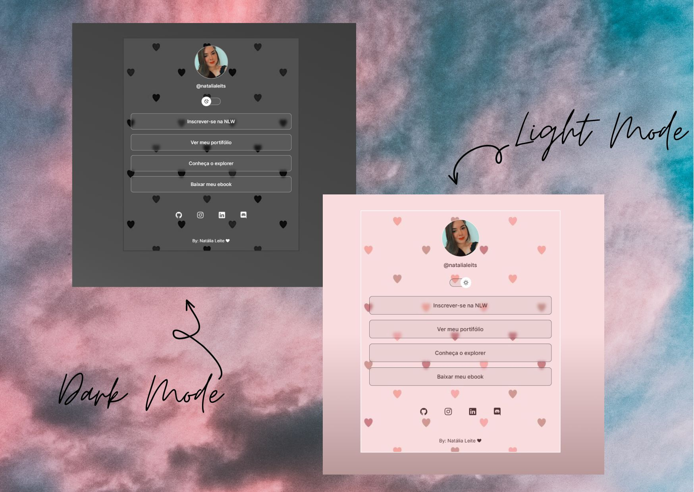

<h1 align="center"> Página de Links </h1>

Projeto desenvolvido no curso DevLinks da Rocketseat, modificado para uma página de apresentação pessoal com lista de links.  

  <a href="#-tecnologias">Tecnologias</a>&nbsp;&nbsp;&nbsp;|&nbsp;&nbsp;&nbsp;
  <a href="#-projeto">Projeto</a>&nbsp;&nbsp;&nbsp;|&nbsp;&nbsp;&nbsp;
  <a href="#-layout">Layout</a>&nbsp;&nbsp;&nbsp;|&nbsp;&nbsp;&nbsp;
  <a href="#memo-licença">Licença</a>

  

 

  

## 🚀 Tecnologias

Esse projeto foi desenvolvido com as seguintes tecnologias:

- HTML e CSS
- JavaScript
- Git e Github
- Figma

## 💻 Projeto

Projeto de apresentação de links pessoais, como cartão de visitas online.

<a href="https://natalialeites.github.io/page-links/" target="_blank"> -Visite o projeto online </a>

## 🔖 Layout

Você pode visualizar o layout inicial do projeto através [DESSE LINK](<https://www.figma.com/file/j8lzVgb2GM3vWCwFKjcSPT/DevLinks-(Community)?node-id=0%3A1&t=LyQKCgLyIEi9od3b-0>). É necessário ter conta no [Figma](https://figma.com) para acessá-lo. (by Rocketseat)

## 📝 Licença

Esse projeto está sob a licença MIT.

---

by Natália Leite ♥
